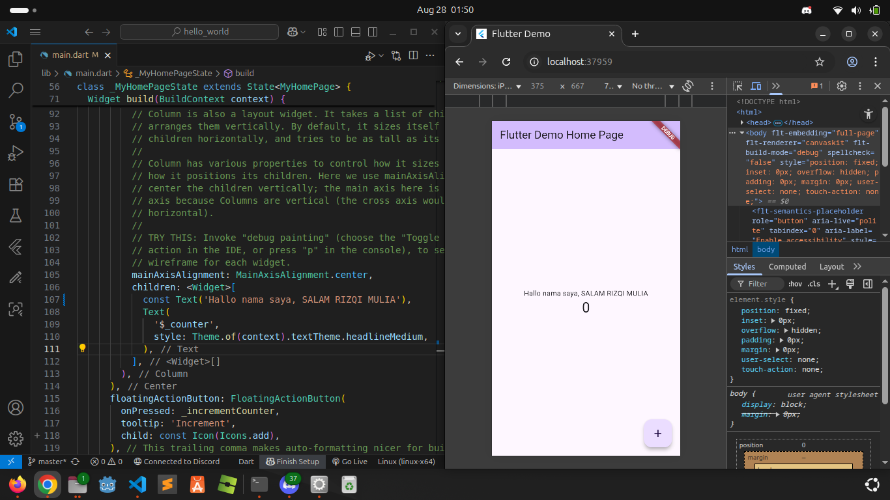
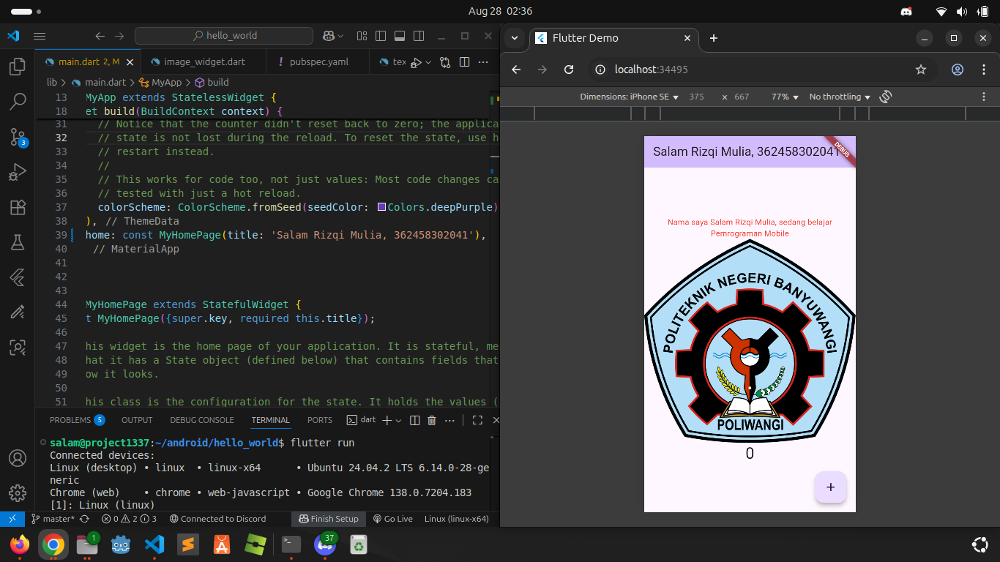
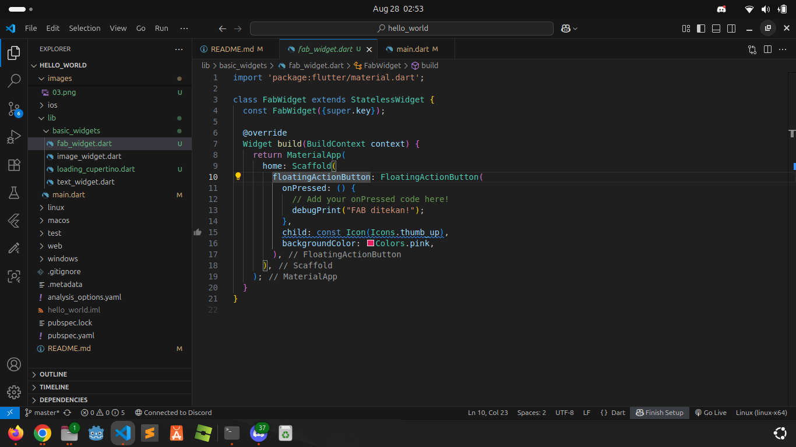
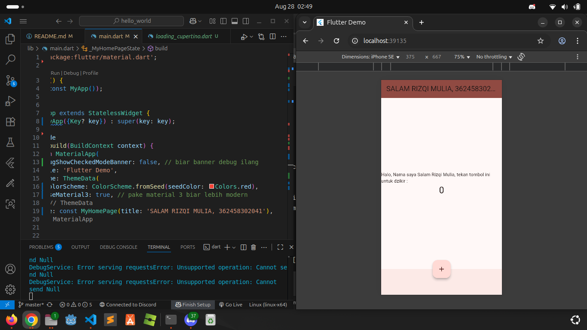
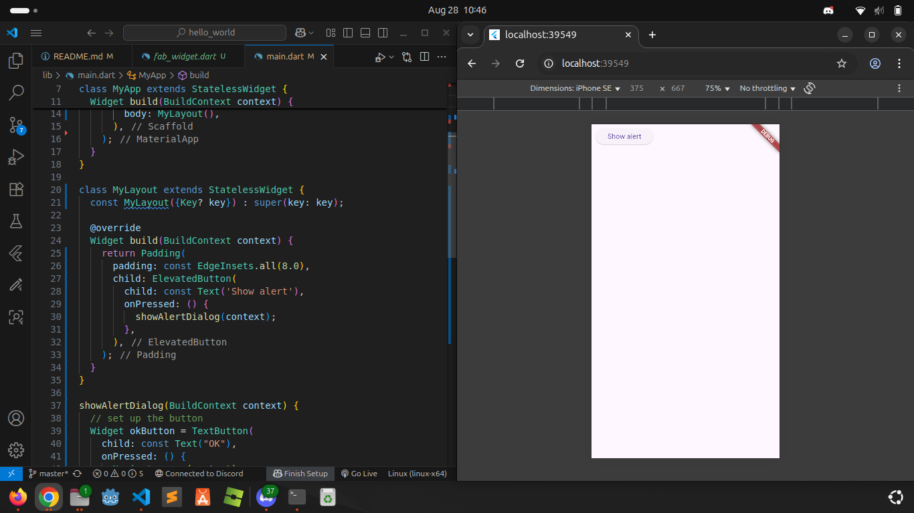
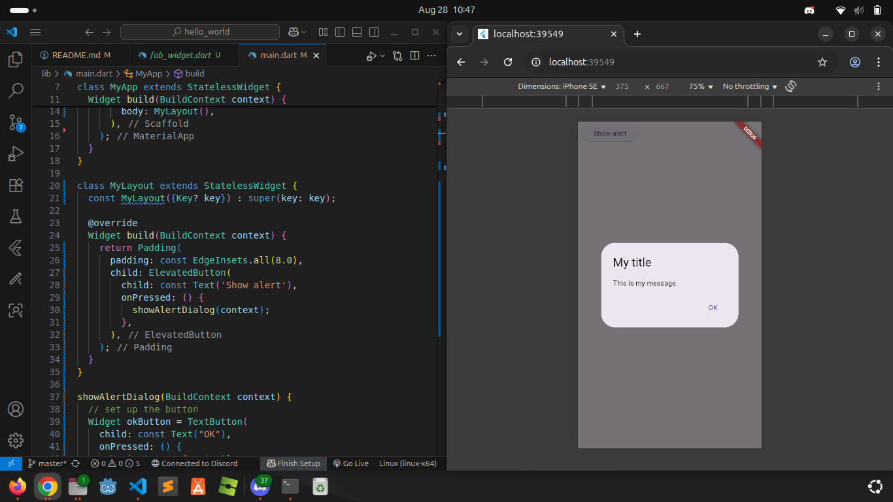

# hello_world

A new Flutter project.

### Praktikum 3, Membuat Repository Github dan Laporan Praktikum
Tangkapan layar pada Praktikum 3, hasil dari menjakankan project hello_world

### Praktikum 4, Menerapkan Widget Dasar
Tangkapan layar pada Praktikum 4, hasil dari menjalankan project hello_world, setelah ditambahkan dengan Widget Text dan Image

### Praktikum 5, Menerapkan Widget Material Design dan iOS Cuppertino
**Langkah 2: Floating Action Button (FAB)**. Tangkapan layar dari langkah 2, *Floating Action Button* sebagai tombol yang terdapat beberapa macam jenis pada flutter yaitu  ButtonBar, DropdownButton, TextButton, FloatingActionButton, IconButton, OutlineButton, PopupMenuButton, dan ElevatedButton..

**Langkah 3: Scaffold Widget**. Tangkapan layar dari Langkah 3, Scaffold Widget digunakan untuk mengatur tata letak sesuai dengan material design

**Langkah 4: Dialog Widget**. Dialog widget pada flutter memiliki dua jenis dialog yaitu *AlertDialog* dan *SimpleDialog*

Berikut tangkapan layar yang menampilkan *Alert Dialog*
